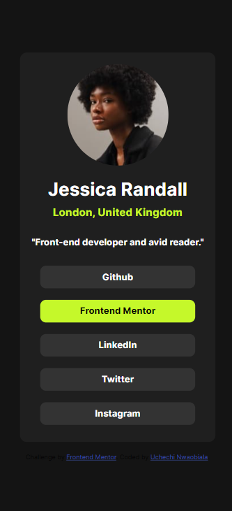
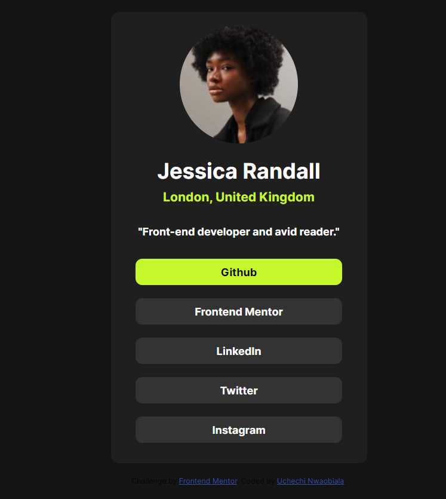

# Frontend Mentor - Social links profile solution

This is a solution to the [Social links profile challenge on Frontend Mentor](https://www.frontendmentor.io/challenges/social-links-profile-UG32l9m6dQ). Frontend Mentor challenges help you improve your coding skills by building realistic projects. 

## Table of contents

- [Overview](#overview)
  - [The challenge](#the-challenge)
  - [Screenshot](#screenshot)
  - [Links](#links)
- [My process](#my-process)
  - [Built with](#built-with)
  - [What I learned](#what-i-learned)
  - [Continued development](#continued-development)
  - [Useful resources](#useful-resources)
- [Author](#author)
- [Acknowledgments](#acknowledgments)

**Note: Delete this note and update the table of contents based on what sections you keep.**

## Overview

### The challenge

Users should be able to:

- See hover and focus states for all interactive elements on the page

### Screenshot



### Links

- Solution URL: [Add solution URL here](https://github.com/Uchyy/social-links-profile-main)
- Live Site URL: [Add live site URL here](https://uchyy.github.io/social-links-profile-main/)

## My process

### Built with

- Semantic HTML5 markup
- CSS custom properties
- Flexbox
- CSS Grid
- Mobile-first workflow
- [React](https://reactjs.org/) - JS library
- [Next.js](https://nextjs.org/) - React framework
- [Styled Components](https://styled-components.com/) - For styles


Use this section to recap over some of your major learnings while working through this project. Writing these out and providing code samples of areas you want to highlight is a great way to reinforce your own knowledge.

To see how you can add code snippets, see below:

```html
<div class="socials" > <a href="#">Github</a></div>
    <div class="socials" > <a href="#">Frontend Mentor</a></div>
    <div class="socials" ><a href="#">LinkedIn</a></div>
    <div class="socials" ><a href="#">Twitter</a></div>
    <div class="socials" ><a href="#">Instagram</a></div>
```
```css
.socials a {
    text-decoration: none;
    font-weight: bolder;
    color: inherit;
    display: block;
    padding: 10px;
    
}

.socials :hover {
    background-color: hsl(75, 94%, 57%);
    color: black;
    border-radius: 10px;
}
```


If you want more help with writing markdown, we'd recommend checking out [The Markdown Guide](https://www.markdownguide.org/) to learn more.


### Continued development

Learning JavaScripts
Expertice with CSS

**Note: Delete this note and the content within this section and replace with your own plans for continued development.**

### Useful resources

- [Example resource 1](https://www.googlefonts.com) - This helped me with fonts. I really liked this pattern and will use it going forward.

## Author

- Uchechi Nwaobiala
- Frontend Mentor - [@yourusername](https://www.frontendmentor.io/profile/Uchyy)

## Acknowledgments

This is where you can give a hat tip to anyone who helped you out on this project. Perhaps you worked in a team or got some inspiration from someone else's solution. This is the perfect place to give them some credit.
